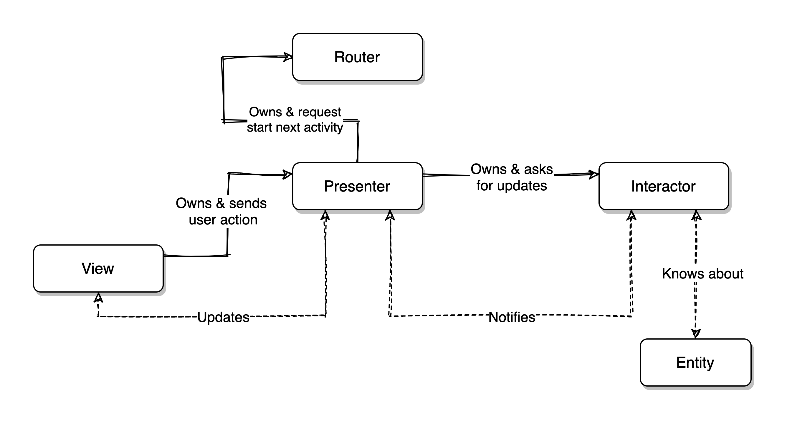

# FxRate - VIPER + Dagger2 + RxJava2 + Mockito &amp; Espresso + Retrofit &amp; Moshi

This is a demo app showing daily updated foreign exchange reference rates from the European Central Bank. The purpose of this demo app is to demonstrate Android Java application in VIPER clean architecture. The source code is organized into different layers of VIPER architecture and each layer of VIPER architecture are described below:



## **View**
`View` is an interface that contains method to display data it gets from presenter.

```java
interface View extends BaseView<Presenter, Object> {

    interface OnItemClickListener {
        void onCurrencyItemClicked(Pair<String, String> currencyPair);
    }

    void setLastUpdate(String lastUpdate);
}
 ```
 
Activity or Fragment can used to implement the View. Below is the example of `CurrencyListActivity` -

```java
public class CurrencyListActivity extends BaseActivity implements CurrencyListContract.View {

    @BindView(R.id.rlLoadingView) RelativeLayout loadingView;
    @BindView(R.id.rlEmptyView) RelativeLayout emptyView;
    @BindView(R.id.rlErrorView) RelativeLayout errorView;
    @BindView(R.id.tvLastUpdated) TextView lastUpdated;
    @BindView(R.id.srCurrencyList) SwipeRefreshLayout swipeRefresh;
    @BindView(R.id.rvCurrencyList) RecyclerView rvCurrencyList;


    @Inject CurrencyListPresenter presenter;
    @Inject CurrencyListAdapter adapter;
    @Inject Router router;

    private final OnItemClickListener onCurrencyClickListener = new OnItemClickListener() {
        @Override
        public void onCurrencyItemClicked(Pair<String, String> currencyPair) {
            router.navigateToCurrencyTimeline(CurrencyListActivity.this, currencyPair);
        }
    };

    @Override
    protected void onCreate(Bundle savedInstanceState) {
        super.onCreate(savedInstanceState);
        setContentView(R.layout.activity_main);
        getApplicationComponent().inject(this);
        presenter.setView(this);
        ButterKnife.bind(this);

        swipeRefresh.setOnRefreshListener(() -> presenter.refreshList());
        rvCurrencyList.setLayoutManager(new LinearLayoutManager(this, RecyclerView.VERTICAL,false));
        rvCurrencyList.setAdapter(adapter);
        adapter.setOnItemClickListener(onCurrencyClickListener);

    }

    @Override
    public void onResume() {
        super.onResume();
        renderLoading();
        presenter.start();
    }

    @Override
    protected void onDestroy() {
        super.onDestroy();
        presenter.destroy();
    }

    @Override
    public void onActivityResult(int requestCode, int resultCode, Intent data) {
        super.onActivityResult(requestCode, resultCode, data);
        presenter.result(requestCode, resultCode);
    }

    @Override
    public void render(Object result) {

        loadingView.setVisibility(View.INVISIBLE);
        emptyView.setVisibility(View.INVISIBLE);
        errorView.setVisibility(View.INVISIBLE);
        swipeRefresh.setRefreshing(false);
        swipeRefresh.setVisibility(View.VISIBLE);
        adapter.setData((CurrencyEntity) result);
        adapter.notifyDataSetChanged();
    }

    @Override
    public void renderLoading() {
        loadingView.setVisibility(View.VISIBLE);
        emptyView.setVisibility(View.INVISIBLE);
        errorView.setVisibility(View.INVISIBLE);
        swipeRefresh.setVisibility(View.INVISIBLE);
    }

    @Override
    public void renderEmpty() {
        loadingView.setVisibility(View.INVISIBLE);
        emptyView.setVisibility(View.VISIBLE);
        errorView.setVisibility(View.INVISIBLE);
        swipeRefresh.setVisibility(View.INVISIBLE);
    }

    @Override
    public void renderError() {
        loadingView.setVisibility(View.INVISIBLE);
        emptyView.setVisibility(View.INVISIBLE);
        errorView.setVisibility(View.VISIBLE);
        swipeRefresh.setVisibility(View.INVISIBLE);
    }

    @OnClick(R.id.btnErrorRetry)
    void errorRetryClicked() {
        renderLoading();
        presenter.refreshList();
    }

    @Override
    public void setLastUpdate(String lastUpdateText) {
        lastUpdated.setText("Last Updated " + lastUpdateText);
    }
}
```


## Interactor

Interactor is also called Use Case that resides in the Domain layer of CLEAN architecture. This is the place to write core business logic, one of the big difference with MVP is moving the domain layer from the presenters, this helps to avoid code repetition on presenters by reusing the interactor in presenters that need same business logic.

The execution of these use cases is done in a background thread. The domain layer is completely decoupled from the Android SDK or other third party libraries, which can be tested independently without the dependency on platform/framework specific things i.e Context, Database. 


```java
public class GetCurrencyList extends UseCase<CurrencyEntity, GetCurrencyList.Params> {

    private final CurrencyRepository currencyRepository;
    private final CurrencyModelMapper mapper;

    @Inject
    public GetCurrencyList(CurrencyRepository currencyRepository, CurrencyModelMapper mapper, ThreadExecutor threadExecutor, UIThread UIThread) {
        super(threadExecutor, UIThread);
        this.currencyRepository = currencyRepository;
        this.mapper = mapper;
    }

    @Override
    Observable<CurrencyEntity> buildUseCaseObservable(Params params) {
        if (params.forceUpdate) currencyRepository.refreshCurrencyRate();
        Calendar cal = Calendar.getInstance();
        cal.setTime(new Date());
        cal.add(Calendar.DATE, -10);
        String dateString = new SimpleDateFormat("yyyy-MM-dd").format(cal.getTime());
        return currencyRepository.getRateList(dateString, params.baseCurrency).map(this.mapper::transform);
    }

    public static class Params {

        final String baseCurrency;
        public final boolean forceUpdate;

        private Params(String baseCurrency, boolean forceUpdate) {
            this.baseCurrency = baseCurrency;
            this.forceUpdate = forceUpdate;
        }

        public static Params create(String baseCurrency, boolean forceUpdate) {
            return new Params(baseCurrency, forceUpdate);
        }
    }
}
```
Here you can see that interactor is unwrapping contents in Params class into arguments of `CurrencyRepository`'s `getRateList` method. `CurrencyRepository` is the data source and will be explained in detail later in this document.

## Presenter
The Presenter is responsible for presentation logic. It decides how data will be presented to the user. The Presenter organizes the response sent by the Interactor into a suitable format to show in UI.

```java
public class CurrencyListPresenter implements CurrencyListContract.Presenter {

    public CurrencyListContract.View currencyListView;

    final GetCurrencyList getCurrencyListUseCase;
    final GetLastUpdated getLastUpdatedUseCase;

    @Inject
    public CurrencyListPresenter(GetCurrencyList getCurrencyListUseCase, GetLastUpdated getLastUpdatedUseCase) {
        this.getCurrencyListUseCase = getCurrencyListUseCase;
        this.getLastUpdatedUseCase = getLastUpdatedUseCase;
    }

    @Override
    public void setView(BaseView v) {
        currencyListView =  (CurrencyListContract.View) v;
    }

    private void getCurrencyList(String baseCurrency, boolean forceUpdate) {
        getCurrencyListUseCase.execute(new DisposableObserver<CurrencyEntity>() {
            @Override
            public void onNext(@NonNull CurrencyEntity currencyEntity) {
                if (currencyEntity.rates.isEmpty()) {
                    currencyListView.renderEmpty();
                } else {
                    currencyListView.render(currencyEntity);
                }
            }

            @Override
            public void onError(@NonNull Throwable e) {
                Log.i("CurrencyListPresenter", e.toString());
                currencyListView.renderError();
            }

            @Override
            public void onComplete() {
                getLastUpdated();
            }
        }, GetCurrencyList.Params.create(baseCurrency, forceUpdate));
    }

    public void refreshList() {
        getCurrencyList("MYR", true);
    }

    public void getLastUpdated() {
        getLastUpdatedUseCase.execute(new DisposableObserver<String>() {
            @Override
            public void onNext(@NonNull String s) {
                currencyListView.setLastUpdate(s);
            }

            @Override
            public void onError(@NonNull Throwable e) {

            }

            @Override
            public void onComplete() {

            }
        }, null);
    }

    @Override
    public void start() {
        getCurrencyList("MYR", false);
    }
    
    @Override
    public void destroy() {
        currencyListView = null;
        getCurrencyListUseCase.dispose();
        getLastUpdatedUseCase.dispose();
    }
}
```

## Entity
Entities are the model objects manipulated by an Interactor. Entities are only manipulated by the Interactor.

```java
public class CurrencyEntity {

    public String base;
    public String date;
    public List<Pair<String,String>> rates = new ArrayList<>();
    public Map<String,String> historyRate = new HashMap<>();
    public static Map<String,String> currencyName = new HashMap<>();

    static {
        currencyName.put("AUD", "Australian Dollar");
        currencyName.put("BGN", "Bulgarian Lev");
        currencyName.put("BRL", "Brazilian Real");
        currencyName.put("CAD", "Canadian Dollar");
        currencyName.put("CHF", "Swiss Franc");
        currencyName.put("CNY", "Yuan");
        currencyName.put("CZK", "Czech Koruna");
        currencyName.put("DKK", "Danish Krone");
        currencyName.put("EUR", "Euro");
        currencyName.put("GBP", "Pound Sterling");
        currencyName.put("HKD", "Hong Kong Dollar");
        currencyName.put("HRK", "Croatian Kuna");
        currencyName.put("HUF", "Forint");
        currencyName.put("IDR", "Rupiah");
        currencyName.put("ILS", "New Israeli Shekel");
        currencyName.put("INR", "Indian Rupee");
        currencyName.put("ISK", "Iceland Krona");
        currencyName.put("JPY", "Yen");
        currencyName.put("KRW", "South Korean Won");
        currencyName.put("MXN", "Mexican Peso");
        currencyName.put("NOK", "Norwegian Krone");
        currencyName.put("NZD", "New Zealand Dollar");
        currencyName.put("PHP", "Philippine Peso");
        currencyName.put("PLN", "PZloty");
        currencyName.put("RON", "Leu");
        currencyName.put("RUB", "Russian Ruble");
        currencyName.put("SEK", "Swedish Krona");
        currencyName.put("SGD", "Singapore Dollar");
        currencyName.put("THB", "Baht");
        currencyName.put("TRY", "Turkish Lira");
        currencyName.put("USD", "US Dollar");
        currencyName.put("ZAR", "Rand");
    }

    @Override
    public String toString() {
        return rates.toString() + ' ' + base + ' ' + date + ' ' + historyRate.toString();
    }
}
```

## Router
The router handles the navigation between screens, it's a singleton global instance injected into each View.

```java
@Singleton
public class Router implements CurrencyListContract.Router {

    @Inject
    public Router() {
    }

    @Override
    public void navigateToCurrencyTimeline(Context context, Pair<String, String> currencyPair) {
        if (context != null) {
            Intent intentToLaunch = CurrencyTimelineActivity.getCallingIntent(context, currencyPair);
            context.startActivity(intentToLaunch);
        }
    }
}
```

# Data Layer
`CurrencyRepository` used the repository pattern to provide all exchange rate data. It contains data stores which provide data either from in memory reference, local file cache or REST API.

```java
@Singleton
public class CurrencyRepository implements CurrencyDataSource {

    private final CurrencyLocalDataSource currencyLocalDataSource;
    private final CurrencyRemoteDataSource currencyRemoteDataSource;

    CurrencyModelAPI cachedRateList;
    private boolean cacheIsDirty = false;

    @Inject
    ThreadExecutor threadExecutor;
    @Inject UIThread UIThread;

    @Inject
    public CurrencyRepository(CurrencyLocalDataSource currencyLocalDataSource, CurrencyRemoteDataSource currencyRemoteDataSource) {
        this.currencyLocalDataSource = currencyLocalDataSource;
        this.currencyRemoteDataSource = currencyRemoteDataSource;
    }

    @Override
    public Observable<CurrencyModelAPI> getRateList(String startDate, String baseCurrency) {

        if (cachedRateList != null && !cacheIsDirty) {
            // In Memory Data
            return  Observable.create(emitter -> {
                emitter.onNext(cachedRateList);
                emitter.onComplete();
            });
        }
        else if (!currencyLocalDataSource.isExpired() && currencyLocalDataSource.isCached(baseCurrency)) {
            // Local File Cache Data
            return getTasksFromLocalDataSource(startDate, baseCurrency);
        }
        else {
            // Remote API Data
            return getTasksFromRemoteDataSource(startDate, baseCurrency);
        }
    }

    @Override
    public void saveRateList(CurrencyModelAPI rateList) {
        cachedRateList = rateList;
        currencyLocalDataSource.saveRateList(rateList);
        currencyRemoteDataSource.saveRateList(rateList);
    }

    @Override
    public Observable<String> getLastUpdated() {
        return currencyLocalDataSource.getLastUpdated();
    }

    public void refreshCurrencyRate() {
        cacheIsDirty = true;
        currencyLocalDataSource.evictAll();
    }

    private Observable<CurrencyModelAPI> getTasksFromLocalDataSource(String startDate, String baseCurrency) {

        return currencyLocalDataSource.getRateList(startDate, baseCurrency).map(result -> {
            refreshCache(result);
            return result;
        });
    }
    @SuppressLint("CheckResult")
    private Observable<CurrencyModelAPI> getTasksFromRemoteDataSource(String startDate, String baseCurrency) {

        return currencyRemoteDataSource.getRateList(startDate, baseCurrency)
                .map(result -> {
            refreshLocalDataSource(result);
            refreshCache(result);
            return result;
        });
    }

    private void refreshCache(CurrencyModelAPI currencyList) {
        this.cachedRateList = currencyList;
        cacheIsDirty = false;
    }

    private void refreshLocalDataSource(CurrencyModelAPI currencyList) {
        currencyLocalDataSource.saveRateList(currencyList);
    }
}
```
Here you can check if data is present in local file cache or fetch data from remote data store. Interactor doesn't know where data is coming.


## Data Store
Generic data store for exchange rate.
```java
public interface CurrencyDataSource {

    Observable<CurrencyModelAPI> getRateList(String startDate, String baseCurrency);

    void saveRateList(CurrencyModelAPI rateList);

    Observable<String> getLastUpdated();
}
```

Remote data store which implements `CurrencyDataSource` and fetches exchange rate by making REST calls.

```java
@Singleton
public class CurrencyRemoteDataSource implements CurrencyDataSource {

    private final CurrencyAPI API;


    @Inject
    public CurrencyRemoteDataSource(CurrencyAPI API) {
        this.API = API;
    }

    @Override
    public Observable<CurrencyModelAPI> getRateList(String startDate, String baseCurrency) {

        return API.getCurrencyList(startDate, baseCurrency);
    }

    @Override
    public void saveRateList(CurrencyModelAPI rateList) {

    }

    @Override
    public Observable<String> getLastUpdated() {
        return Observable.just("");
    }
}
```

Local data store fetches exchange rate data from local storage which can be local file cache or database.

```java
@Singleton
public class CurrencyLocalDataSource implements CurrencyDataSource {

    private static final String SETTINGS_FILE_NAME = "io.github.emcthye.fxrate.SETTINGS";
    private static final String SETTINGS_KEY_LAST_CACHE_UPDATE = "last_cache_update";

    private static final String DEFAULT_FILE_NAME = "user_";
    private static final long EXPIRATION_TIME = 12 * 60 * 60 * 1000;

    Context context;
    private final File cacheDir;
    private final Serializer serializer;
    private final FileManager fileManager;
    private final ThreadExecutor threadExecutor;

    @Inject
    public CurrencyLocalDataSource(Context context, Serializer serializer,
                                   FileManager fileManager, ThreadExecutor executor) {
        if (context == null || serializer == null || fileManager == null || executor == null) {
            throw new IllegalArgumentException("Invalid null parameter");
        }
        this.context = context.getApplicationContext();
        this.cacheDir = this.context.getCacheDir();
        this.serializer = serializer;
        this.fileManager = fileManager;
        this.threadExecutor = executor;
    }

    @Override
    public Observable<CurrencyModelAPI> getRateList(String startDate, String baseCurrency) {

        return Observable.create(emitter -> {
            final File userEntityFile = buildFile(baseCurrency);
            final String fileContent = fileManager.readFileContent(userEntityFile);
            final CurrencyModelAPI currencyModelAPI =
                    serializer.deserialize(fileContent);

            if (currencyModelAPI != null) {
                emitter.onNext(currencyModelAPI);
                emitter.onComplete();
            } else {
                emitter.onError(new ErrorMessageFactory.LocalDataException());
            }
        });
    }

    @Override
    public void saveRateList(CurrencyModelAPI rateList) {
        final File userEntityFile = this.buildFile(rateList.base);
        if (!isCached(rateList.base)) {
            final String jsonString = this.serializer.serialize(rateList);
            this.executeAsynchronously(new CacheWriter(this.fileManager, userEntityFile, jsonString));
            setLastCacheUpdateTimeMillis();
        }
    }

    @Override
    public Observable<String> getLastUpdated() {
        return Observable.create(emitter -> {
            emitter.onNext(getRelativeTimeSpanString(getLastCacheUpdateTimeMillis(), System.currentTimeMillis(),
                    DateUtils.SECOND_IN_MILLIS).toString());
            emitter.onComplete();
        });
    }

    public boolean isCached(String baseCurrency) {
        final File userEntityFile = this.buildFile(baseCurrency);
        return this.fileManager.exists(userEntityFile);
    }

    public boolean isExpired() {
        long currentTime = System.currentTimeMillis();
        long lastUpdateTime = this.getLastCacheUpdateTimeMillis();

        boolean expired = ((currentTime - lastUpdateTime) > EXPIRATION_TIME);

        if (expired) {
            this.evictAll();
        }

        return expired;
    }

    public void evictAll() {
        this.executeAsynchronously(new CacheEvictor(this.fileManager, this.cacheDir));
    }

    protected File buildFile(String baseCurrency) {
        String fileNameBuilder = this.cacheDir.getPath() +
                File.separator +
                DEFAULT_FILE_NAME +
                baseCurrency;
        return new File(fileNameBuilder);
    }

    protected void setLastCacheUpdateTimeMillis() {
        final long currentMillis = System.currentTimeMillis();
        this.fileManager.writeToPreferences(this.context, SETTINGS_FILE_NAME,
                SETTINGS_KEY_LAST_CACHE_UPDATE, currentMillis);
    }

    protected long getLastCacheUpdateTimeMillis() {
        return this.fileManager.getFromPreferences(this.context, SETTINGS_FILE_NAME,
                SETTINGS_KEY_LAST_CACHE_UPDATE);
    }

    protected void executeAsynchronously(Runnable runnable) {
        this.threadExecutor.execute(runnable);
    }
}
```

## Mappers
Mappers are used to convert entity of one layer to another layer.
For example, REST API is returning CurrencyModelAPI object which will be modified in domain layer. Following is the mapper class which converts `CurrencyModelAPI` to `CurrencyEntity`.

```java
@Singleton
public class CurrencyModelMapper {

    private static final DecimalFormat df = new DecimalFormat("0.00");

    @Inject
    public CurrencyModelMapper() {}

    public CurrencyEntity transform(CurrencyModelAPI currencyObj) {
        CurrencyEntity entity = new CurrencyEntity();
        entity.base = currencyObj.base;
        entity.date = currencyObj.end_date;

        for (Map.Entry<String, Map<String, Float>> date : currencyObj.dates.entrySet()) {

            for (Map.Entry<String, Float> rate : date.getValue().entrySet()) {
                String historyRate =  entity.historyRate.containsKey(rate.getKey()) ?
                entity.historyRate.get(rate.getKey()) : "";

                historyRate = historyRate + rate.getValue().toString() + ',';
                entity.historyRate.put(rate.getKey(), historyRate);
            }
        }

        for (Map.Entry<String, Float> entry : currencyObj.dates.get(currencyObj.end_date).entrySet()) {
            if (entry.getValue() < 1) {
                entity.rates.add(new Pair<>(entry.getKey(),
                        String.valueOf(1) + '-' + df.format(1/entry.getValue())));
            } else {
                entity.rates.add(new Pair<>(entry.getKey(), df.format(entry.getValue()) + '-' + 1));
            }
        }
        return entity;
    }
}
```

# Testing
With this approach, domain code tested with unit tests without Android dependencies. This can be extended with integration tests, that cover from Interactor to the boundaries of View and repository. This project contains unit test cases of different layers. Following are some examples of test cases:
## Remote Data Store
```java
@RunWith(MockitoJUnitRunner.class)
public class CurrencyRemoteDataSourceTest {

    private CurrencyRemoteDataSource remoteDataSource;

    @Mock CurrencyAPI api;

    @Before
    public void setUp() throws Exception {
        remoteDataSource = new CurrencyRemoteDataSource(api);
    }

    @Test
    public void getRateList() {

        remoteDataSource.getRateList("2020-03-21", "MYR");

        verify(api).getCurrencyList("2020-03-21", "MYR");
    }
}
```
## Local Data Store
```java
@RunWith(AndroidJUnit4.class)
@MediumTest
public class CurrencyLocalDataSourceTest {

    private CurrencyLocalDataSource local;

    @Mock FileManager fileManager;
    @Mock Serializer serializer;
    @Mock ThreadExecutor threadExecutor;

    @Before
    public void setUp() throws Exception {

        MockitoAnnotations.initMocks(this);
        CurrencyLocalDataSource localDataSource = new CurrencyLocalDataSource(
                InstrumentationRegistry.getInstrumentation().getTargetContext(),
                serializer,
                fileManager,
                threadExecutor);
        local = Mockito.spy(localDataSource);
    }

    @Test
    public void isCached() {

        local.isCached("MYR");
        verify(fileManager).exists(any());
    }

    @Test
    public void saveRateList() {

        when(serializer.serialize(any())).thenReturn("test");

        doReturn(mock(File.class)).when(local).buildFile(any());

        CurrencyModelAPI currencyModelAPI = new CurrencyModelAPI();
        local.saveRateList(currencyModelAPI);

        ArgumentCaptor<CurrencyModelAPI> obj = ArgumentCaptor.forClass(CurrencyModelAPI.class);
        verify(serializer).serialize(obj.capture());
        assertEquals(currencyModelAPI, obj.getValue());

        verify(local).executeAsynchronously(any());
    }

    @Test
    public void getRateList() throws IOException {

        when(serializer.deserialize(any())).thenReturn("test");

        local.getRateList("2020-03-22", "MYR").subscribeWith(new Observer<CurrencyModelAPI>() {
            @Override
            public void onSubscribe(@NonNull Disposable d) {

            }

            @Override
            public void onNext(@NonNull CurrencyModelAPI currencyModelAPI) {

            }

            @Override
            public void onError(@NonNull Throwable e) {

            }

            @Override
            public void onComplete() {

            }
        });

        verify(serializer).deserialize(any());
        verify(fileManager).readFileContent(any());

    }

    @Test
    public void getLastUpdated() {

        local.getLastUpdated().subscribeWith(new Observer<String>() {
            @Override
            public void onSubscribe(@NonNull Disposable d) {

            }

            @Override
            public void onNext(@NonNull String s) {

            }

            @Override
            public void onError(@NonNull Throwable e) {

            }

            @Override
            public void onComplete() {

            }
        });

        verify(local).getLastCacheUpdateTimeMillis();
    }

    @Test
    public void isExpired() {

        local.isExpired();
        
        verify(local).getLastCacheUpdateTimeMillis();

    }

    @Test
    public void evictAll() {

        local.evictAll();
        
        verify(local).executeAsynchronously(any());
    }
}
```
## Data Repository
```java
@RunWith(MockitoJUnitRunner.class)
public class CurrencyRepositoryTest {

    CurrencyRepository repository;

    @Mock CurrencyLocalDataSource localDataSource;
    @Mock CurrencyRemoteDataSource remoteDataSource;

    @Before
    public void setUp() throws Exception {
        repository = new CurrencyRepository(localDataSource, remoteDataSource);
    }

    @Test
    public void testRemoteRateList() {

        when(localDataSource.isExpired()).thenReturn(true);
        when(remoteDataSource.getRateList(any(), any())).thenReturn(Observable.just(new CurrencyModelAPI()));

        repository.getRateList("2021-03-20", "MYR");

        assertNull(repository.cachedRateList);
        verify(localDataSource, never()).getRateList("2021-03-20", "MYR");
        verify(remoteDataSource).getRateList("2021-03-20", "MYR");
    }

    @Test
    public void testLocalFileRateList() {

        when(localDataSource.isExpired()).thenReturn(false);
        when(localDataSource.isCached(any())).thenReturn(true);
        when(localDataSource.getRateList(any(), any())).thenReturn(Observable.just(new CurrencyModelAPI()));

        repository.getRateList("2021-03-20", "MYR");

        assertNull(repository.cachedRateList);
        verify(localDataSource).getRateList("2021-03-20", "MYR");
        verify(remoteDataSource, never()).getRateList("2021-03-20", "MYR");
    }

    @Test
    public void testInMemoryRateList() {

        repository.cachedRateList = new CurrencyModelAPI();
        assertNotNull(repository.cachedRateList);

        repository.getRateList("2021-03-20", "MYR");

        verify(localDataSource, never()).getRateList("2021-03-20", "MYR");
        verify(remoteDataSource, never()).getRateList("2021-03-20", "MYR");

    }

    @Test
    public void testSaveRateList() {

        CurrencyModelAPI obj = new CurrencyModelAPI();
        repository.saveRateList(obj);

        assertEquals(obj, repository.cachedRateList);
        verify(localDataSource).saveRateList(obj);
        verify(remoteDataSource).saveRateList(obj);
    }

    @Test
    public void testGetLastUpdated() {

        Observable<String> obj = Observable.just("33m ago");
        when(localDataSource.getLastUpdated()).thenReturn(obj);

        Observable<String> result = repository.getLastUpdated();

        verify(localDataSource).getLastUpdated();
        verify(remoteDataSource, never()).getLastUpdated();
        assertEquals(obj, result);
    }

    @Test
    public void testRefreshCurrencyRate() {

        repository.refreshCurrencyRate();

        verify(localDataSource).evictAll();
    }
}
```
## Interactor

```java
@RunWith(MockitoJUnitRunner.class)
public class GetCurrencyListTest {

    private GetCurrencyList usecase;

    @Mock CurrencyRepository repository;
    @Mock CurrencyModelMapper mapper;
    @Mock UIThread uiThread;
    @Mock ThreadExecutor threadExecutor;

    @Before
    public void setup() {

        when(uiThread.getScheduler()).thenReturn(mock(Scheduler.class));
        usecase = new GetCurrencyList(repository, mapper, threadExecutor, uiThread);
        usecase = spy(usecase);
    }

    @Test public void testBuildObservable() {

        Observable<CurrencyModelAPI> observable = Observable.just(new CurrencyModelAPI());
        when(repository.getRateList(anyString(), any())).thenReturn(observable);

        usecase.execute(new DisposableObserver<CurrencyEntity>() {
            @Override
            public void onNext(@NonNull CurrencyEntity currencyEntity) {

            }

            @Override
            public void onError(@NonNull Throwable e) {

            }

            @Override
            public void onComplete() {

            }
        }, GetCurrencyList.Params.create("MYR", false));

        verify(repository, never()).refreshCurrencyRate();
        verify(repository).getRateList(anyString(), eq("MYR"));
        assertEquals(usecase.disposables.size(), 1);
    }

    @Test public void testClearDispose() {

        usecase.disposables.add(mock(Disposable.class));
        usecase.dispose();
        assertTrue(usecase.disposables.isDisposed());
    }
}
```
## Presenter
```java
@RunWith(MockitoJUnitRunner.class)
public class CurrencyListPresenterTest {

    private CurrencyListPresenter presenter;

    @Mock private CurrencyListContract.View currencyListView;
    @Mock private GetCurrencyList getCurrencyList;
    @Mock private GetLastUpdated getLastUpdated;

    @Before
    public void setUp() {
        presenter = new CurrencyListPresenter(getCurrencyList, getLastUpdated);
        presenter.setView(currencyListView);
    }

    @Test
    public void setView() {
        presenter.setView(currencyListView);
        assertNotNull(presenter.currencyListView);
    }

    @Test
    public void refreshList() {

        Mockito.mock(UIThreadImpl.class);

        ArgumentCaptor<GetCurrencyList.Params> valueCapture = ArgumentCaptor.forClass(GetCurrencyList.Params.class);

        presenter.refreshList();
        verify(getCurrencyList).execute(any(DisposableObserver.class), valueCapture.capture());
        assertTrue(valueCapture.getValue().forceUpdate);
    }

    @Test
    public void getLastUpdated() {

        doAnswer((Answer<Void>) invocation -> {
            DisposableObserver<String> observer = invocation.getArgument(0);
            observer.onNext("Last Updated");
            verify(currencyListView).setLastUpdate("Last Updated");
            return null;
        }).when(getLastUpdated).execute(any(),any());

        presenter.getLastUpdated();

        verify(getLastUpdated).execute(any(DisposableObserver.class), any());
    }

    @Test
    public void start() {

        ArgumentCaptor<DisposableObserver> valueCapture = ArgumentCaptor.forClass(DisposableObserver.class);
        ArgumentCaptor<GetCurrencyList.Params> forceUpdateCapture = ArgumentCaptor.forClass(GetCurrencyList.Params.class);

        presenter.start();

        verify(getCurrencyList).execute(valueCapture.capture(), forceUpdateCapture.capture());
        CurrencyEntity obj = new CurrencyEntity();
        List<Pair<String,String>> rate = new ArrayList<>();
        rate.add(new Pair<>("USD", "1-0.25"));
        obj.rates = rate;
        DisposableObserver<CurrencyEntity> callback = valueCapture.getValue();
        callback.onNext(obj);

        verify(currencyListView).render(obj);
        assertFalse(forceUpdateCapture.getValue().forceUpdate);
    }

    @Test
    public void testGetCurrencyListHappyCase() {

        doAnswer((Answer<Void>) invocation -> {
            DisposableObserver<CurrencyEntity> callback = invocation.getArgument(0);
            CurrencyEntity obj = new CurrencyEntity();
            List<Pair<String,String>> rate = new ArrayList<>();
            rate.add(new Pair<>("USD", "1-0.25"));
            obj.rates = rate;
            callback.onNext(obj);
            verify(currencyListView).render(obj);
            return null;
        }).when(getCurrencyList).execute(any(), any());

        presenter.start();
    }

    @Test
    public void destroy() {

        presenter.destroy();

        verify(getCurrencyList).dispose();
        verify(getLastUpdated).dispose();
        assertNull(presenter.currencyListView);
    }
}
```

## View

```java
@RunWith(AndroidJUnit4.class)
@MediumTest
public class CurrencyListActivityTest {

    @Rule
    public ActivityScenarioRule<CurrencyListActivity> activityScenarioRule =
            new ActivityScenarioRule<>(CurrencyListActivity.class);

    @Test
    public void render() {

        CurrencyEntity obj = new CurrencyEntity();
        List<Pair<String,String>> rate = new ArrayList<>();
        rate.add(new Pair<>("USD", "1-0.25"));
        obj.rates = rate;

        activityScenarioRule.getScenario().onActivity(activity -> activity.render(obj));

        onView(withId(R.id.rvCurrencyList)).perform(
                RecyclerViewActions.scrollTo(hasDescendant(
                        withText(containsString("USD")))));

        onView(withId(R.id.rvCurrencyList)).check(matches(hasChildCount(1)));

        Intents.init();
        onView(withId(R.id.rvCurrencyList)).perform(RecyclerViewActions.actionOnItemAtPosition(0, click()));
        intended(allOf(hasComponent(CurrencyTimelineActivity.class.getName())));
        Intents.release();
    }

    @Test
    public void onResume() {
        activityScenarioRule.getScenario().moveToState(Lifecycle.State.RESUMED);
        activityScenarioRule.getScenario().onActivity(activity ->
                verify(activity.presenter).start());
    }

    @Test
    public void renderLoading() {

        activityScenarioRule.getScenario().onActivity(CurrencyListActivity::renderLoading);

        onView(withId(R.id.rlEmptyView)).check(matches(not(isDisplayed())));
        onView(withId(R.id.rvCurrencyList)).check(matches(not(isDisplayed())));
        onView(withId(R.id.rlLoadingView)).check(matches(isDisplayed()));
        onView(withId(R.id.rlErrorView)).check(matches(not(isDisplayed())));
    }

    @Test
    public void renderEmpty() {

        activityScenarioRule.getScenario().onActivity(CurrencyListActivity::renderEmpty);

        onView(withId(R.id.rlEmptyView)).check(matches(isDisplayed()));
        onView(withId(R.id.rvCurrencyList)).check(matches(not(isDisplayed())));
        onView(withId(R.id.rlLoadingView)).check(matches(not(isDisplayed())));
        onView(withId(R.id.rlErrorView)).check(matches(not(isDisplayed())));
    }

    @Test
    public void renderError() {

        activityScenarioRule.getScenario().onActivity(CurrencyListActivity::renderError);

        onView(withId(R.id.rlErrorView)).check(matches(isDisplayed()));
        onView(withId(R.id.rvCurrencyList)).check(matches(not(isDisplayed())));
        onView(withId(R.id.rlLoadingView)).check(matches(not(isDisplayed())));
        onView(withId(R.id.rlEmptyView)).check(matches(not(isDisplayed())));
    }

    @Test
    public void errorRetryClicked() {

        activityScenarioRule.getScenario().onActivity(CurrencyListActivity::renderError);
        onView(withId(R.id.btnErrorRetry)).perform(click());

        activityScenarioRule.getScenario().onActivity(activity ->
                verify(activity.presenter).refreshList());
    }

    @Test
    public void setLastUpdate() {
        activityScenarioRule.getScenario().onActivity(activity -> activity.setLastUpdate("33s ago"));
        onView(withId(R.id.tvLastUpdated)).check(matches(withText("Last Updated " + "33s ago")));
    }
}
```

# Package Structure
There are six packages:
1. **entity -** The package contains data stores i.e. `MoviesDataStore` which is implemented by `CurrencyRemoteDataSource` and `CurrencyLocalDataSource`. These data stores provide exchange rate data to `CurrencyRepository` which provides exchange rate data to Interactor. 
2. **interactor -** This package contains interactors(also called use cases). `GetCurrencyList` is the interactor which gets data from `CurrencyRepository` and provides it to the presentation layer.
3. **router -** It contains `Router` class that provides navigation between screens.
4. **currencyList -** It contains `CurrencyListPresenter` , `CurrencyListAdapter` and `CurrencyListContract.View`. `CurrencyListActivity` implements `CurrencyListContract.View`. `CurrencyListPresenter` gets movies list from `GetCurrencyList`. `Router` handles navigations from currency exchange rate list.
provides it to the presentation layer.
5. **currencyTimeline -** It contains `CurrencyTimelinePresenter` and `CurrencyTimelineContract.View`. `CurrencyTimelineActivity` implements `CurrencyTimelineContract.View`. `CurrencyTimelinePresenter` gets movies list from `GetCurrencyList`.
6. **util -** It contains dependency injection classes, common base classes, error wrapper class etc..


# References
Exchange Rate REST API - https://www.frankfurter.app
